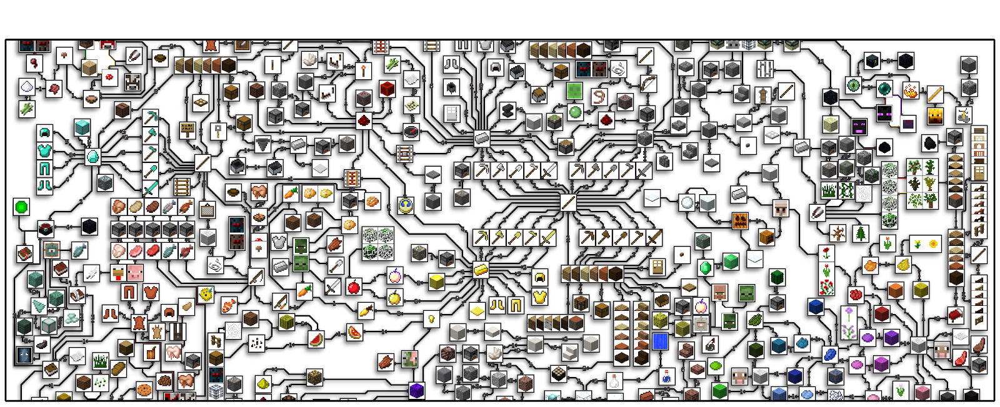

# 《我的世界》中的高效强化学习竞赛

## 摘要

虽然深度强化学习在许多困难领域取得了突破，但这些成功需要越来越多的样本。由于最先进的强化学习（RL）系统需要成倍增加的样本数，因此它们的发展受限于AI社区的不断缩小。同样，许多这样的系统也不能应用于现实世界中的问题，因为环境样本是高附加的。解决这些局限性需要新的、有效的样本方法。为了促进这一方向的研究，本文设计基于人类先验知识的样本有效强化学习的miner竞争。竞争的主要目标是促进算法的发展，这些算法能够有效地利用人类的演示，从而大大减少解决复杂、分层和稀疏环境所需的样本数量。

# 前言

人工智能（AI）的许多最著名的成功，如AlphaStar、AlphaGo、OpenAI-Five及其衍生系统，都利用深度强化学习来实现连续决策任务中人类或超人类水平的性能。正如Amodei和Hernandez所确定的那样，这些技术水平的改进到目前为止都需要指数级地增加计算能力才能达到这样的性能。在一定程度上，这是由于每个环境样本所需计算量的增加；然而，最显著的变化是培训所需的环境样本数。例如，DQN、A3C和Rainbow DQN已应用于ATARI 2600游戏\cite{bellemare2013arcade}，需要44到2亿帧（200到900小时以上）才能达到人类水平的性能。在更复杂的领域：OpenAI Five利用了11000年以上的Dota 2游戏玩法，AlphaGoZero在Go中使用了490万个自玩游戏，AlphaStar使用了200年的星际争霸II游戏。由于不断增长的计算需求，越来越少的人工智能社区拥有资源来改进这些系统并重现最先进的结果。此外，许多强化学习技术应用于现实世界的挑战，如自动驾驶车辆，受到原始样本数量的阻碍。在这些现实世界的领域中，政策推出的成本可能很高，而且模拟器还不够精确，无法生成对现实世界条件稳健的政策。

降低上述方法的环境样本复杂性的一个众所周知的方法是利用人类的先验知识和期望行为的演示。利用轨迹例子的技术，如模仿学习和贝叶斯强化学习，已经成功地应用于旧的基准测试和现实世界的问题，其中来自环境的样本是昂贵的。在许多具有单一任务的简单游戏中，例如Atari 2600、OpenAI Gym和TORCS环境，通过预训练和混合RL技术，模仿学习可以显著减少所需的环境样本数量。此外，在一些实际任务中，如机器人操作和自动驾驶，在这些任务中，从环境中收集大量样本的成本很高，基于模拟的方法通常是使用少量样本生成解的唯一方法。尽管这些技术取得了成功，但对于许多实际领域的应用来说，这些技术仍然不够有效

MineRL 2020竞赛旨在促进算法的发展，这些算法可以有效地利用人类演示，大幅减少解决复杂、层次分明和稀疏环境所需的样本数量。为了实现这一目标，参与者将竞争开发能够在《我的世界》中从原始像素中获取钻石的系统，使用MineRL模拟器中的800万样本，并在一台GPU机器上进行4天的训练。参与者将被提供MineRL-v0数据集(网站，论文)，一个大规模的收集超过6000万帧的人类演示，使他们能够利用专家轨迹来最小化他们的算法与Minecraft模拟器的交互。

## 任务描述

* 仔细阅读MineRL比赛页面
* 设置环境https://github.com/minerlabs/minerl 和 https://github.com/minerlabs/competition提交模板
* 从示例基线中至少运行两个基线-为所提供的miner运行一组竞争和非竞争基线。你需要写一个关于算法的简要总结，以及你选择的每个基线的比赛结果（奖励）。
* 设计你自己的方法来学习玩地雷。有很多方法：选择更好的架构、奖励塑造、调整参数，甚至在策略中添加创造性规则。在你的报告中包括你的最终策略和得分。–只要你在报告中添加参考资料并指出战略的差异，你就可以在竞争对手的竞争中查看其他人的开源代码，如果你觉得任务太具有挑战性，你将一事无成，甚至可以把它们作为出发点。

竞赛的任务是解决MineRL环境。在这种环境中，代理从一个不带任何物品的随机起始位置开始，其任务是获取钻石。这个任务只能通过浏览《我的世界》中复杂的物品层次来完成。代理会因为获得钻石而获得高额奖励，同时也会因为获得先决条件物品而获得较小的辅助奖励。除了主要环境之外，我们还提供了许多辅助环境。这些任务要么是ObtainDiamond的子任务，要么是Minecraft中的其他任务。

# 算法描述

在监督学习中，在强化学习中想要获得好结果相对较难，算法中有许多变化的部分导致难以优化，而且需要花很大的精力在调试上才能得到好结果。Proximal Policy Optimization(PPO)则在实现的难易程度、采样复杂度、调试所需精力之间取得了新的平衡，它在每一步迭代中都会尝试计算新的策略，这样可以让损失函数最小化，同时还能保证与上一步迭代的策略间的偏差相对较小。

$$\nabla \bar{R}_{\theta} = 
  E_{\tau \sim p_{\theta}(\tau)}
  [R(\tau)\nabla\log p_{\theta}(\tau)]$$

如以上公式policy gradient都是on policy。就是使用一个$\theta$来求得数据，之后更新$\theta_1$，得到$\theta_1$之后之前的$\theta$就是错的，所以要用$\theta_1$来重新获得一大堆数据，所以整个过程就是比较墨迹的。可以改进不需要一直用$\theta$来获取数据，于是就有了off policy的情况.

使用重要性采样实现on policy 到off policy的转换，期望值相差较小，为了明确使用off policy以后方差的变化过程。于是计算了方差的公式，发现第二项对于方差的影响是较小，但是第一项对于方差的影响还是有的。于是当使用重要性采样的时候，要保证只有$p(x)$和$q(x)$的区别不大，才会使得方差的区别很小。如果从分布$p$到分布$q$的话，就要乘以$p(x)$/$q(x)$.如以下公式所示。

$$E_{x \sim p}[f(x)] \\=  \int f(x)p(x)dx \\= \int f(x) \frac{p(x)}{q(x)}q(x)dx \\ =   E_{x \sim q}[f(x)\frac{p(x)}{q(x)}]$$

使用$\theta^{'}$采样的数据，训练$\theta$这个actor，过程中$\theta^{'}$是fixed的所以可以重复使用用$\theta^{'}$的数据训练$\theta$许多次，增加数据利用率，提高训练速度，为openAI的default方法。显然，此方法转为了off-policy。因为$\theta^{'}$是与环境交互的actor，所以advantage function 的估计需要使用$\theta^{'}$的数据。

$$E_{s_t,a_t}\sim \pi_{\theta^{'}}[\frac{p_{\theta}(a_t|s_t)}{p_{\theta^{'}(a_t|s_t)}}\frac{p_{\theta}(s_t)}{p_{\theta^{'}(s_t)}}] A^{\theta^{'}(s_t.a_t)\nabla \log P_{\theta}(a^n_t|s^n_t) }$$

上述公式为跟新需要的gradient，其中假设在不同actor中看到的s概率一样，则可以简化。通过gradient可以反推出目标函数.

$$J^{\theta^{'}}(\theta) = E_{(s_t,a_t) \sim \pi_{\theta^{'}}} [\frac{p_{\theta}(a_t|s_t)}{p_{\theta^{'}}(a_t|s_t)}A^{\theta^{'}}(s_t,a_t)]$$

为了使$\theta$和$\theta^{'}$不要相隔太远的话，我们引入了两个新的方法，一种是PPO / TRPO，ppo是trpo的改进版，在编程方面，前者是更加轻松的。引入一个$KL(\theta,\theta^{'} )$，如果$\theta$,$\theta^{'}$ 相差太大，$KL(\theta,\theta^{'} )$的值就非常大，如果$\theta$,$\theta^{'}$ 相差小，$KL(\theta,\theta^{'} )$的值就非常小。PPO2不用计算KL，同样可以控制θ与θ'之间差距.

$$J^{\theta^{k}}_{PPO2}(\theta) \approx \sum\limits_{s_t,a_t} 
\min(\frac{p_\theta(a_t|s_t)}{p_\theta^{k}(a_t|s_t)}A^{\theta^{k}}(s_t,a_t)),clip(\frac{p_\theta(a_t|s_t)}{p_\theta^{k}(a_t|s_t)},1-\varepsilon ,1+\varepsilon)A^{\theta^{k}}(s_t,a_t))$$

# 实验结果

